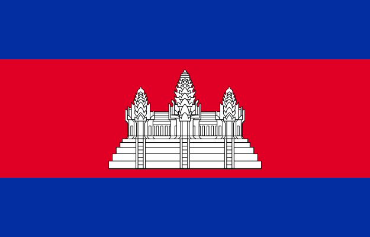
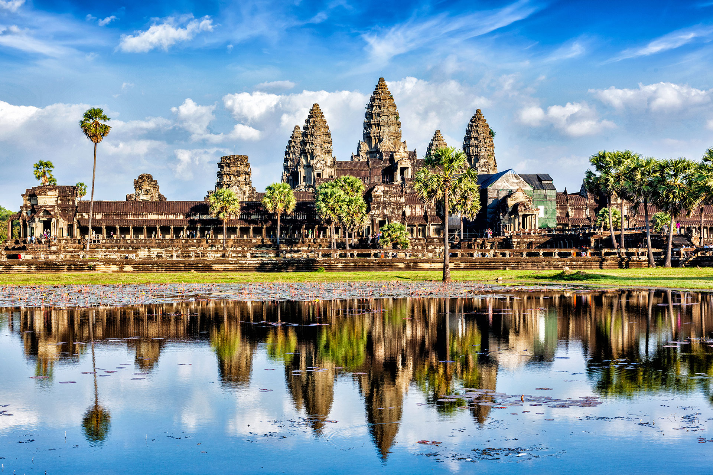

Cambodia

King: Norodom Sihamoni (2004)

Prime Minister: Hun Sen (1998)

Land area: 68,154 sq mi (176,519 sq km); total area: 69,900 sq mi (181,040 sq km)

Population (2014 est.): 15,458,332 (growth rate: 1.63%); birth rate: 24.4/1000; infant mortality rate: 51.36/1000; life expectancy: 63.78

Capital and largest city (2011 est.): Phnom Penh, 1.55 million

Monetary unit: Riel

National Name: Preahreacheanacha Kampuchea

Languages: Khmer (official) 96.3%, other 3.7% (2008 est.)

Ethnicity/race: Khmer 90%, Vietnamese 5%, Chinese 1%, other 4%

National Holiday: Independence Day, November 9

Literacy rate: 73.6% (2011 est.)

Economic summary: GDP/PPP (2013 est.): $39.64 billion; per capita $2,600. Real growth rate: 7%. Inflation: 3.2%. Unemployment: 0% (2011 est.). Arable land: 22.09%. Agriculture: rice, rubber, corn, vegetables, cashews, tapioca. Labor force: 7.9 million (2012 est.); agriculture: 55.8%; industry: 16.9%; services: 27.3% (2010 est.). Industries: tourism, garments, rice milling, fishing, wood and wood products, rubber, cement, gem mining, textiles. Natural resources: oil and gas, timber, gemstones, some iron ore, manganese, phosphates, hydropower potential. Exports: $6.781 billion (2013 est.): clothing, timber, rubber, rice, fish, tobacco, footwear. Imports: $8.895 billion (2013 est.): petroleum products, cigarettes, gold, construction materials, machinery, motor vehicles, pharmaceutical products. Major trading partners: U.S., Germany, UK, Vietnam, Canada, Thailand, Hong Kong, China, Singapore (2012).

Communications: Telephones: main lines in use: 584,000 (2012); mobile cellular: 19.1 million (2012). Broadcast media:mixture of state-owned, joint public-private, and privately owned broadcast media; 9 TV broadcast stations with most operating on multiple channels, including 1 state-operated station broadcasting from multiple locations, 6 stations either jointly operated or privately owned with some broadcasting from several locations, and 2 TV relay stations - one relaying a French TV station and the other relaying a Vietnamese TV station; multi-channel cable and satellite systems are available; roughly 50 radio broadcast stations - 1 state-owned broadcaster with multiple stations and a large mixture of public and private broadcasters; several international broadcasters are available (2009). Internet hosts: 13,784 (2012). Internet users: 78,500 (2009).

Transportation: Railways: total: 690 km (2010). Highways: total: 39,618 km; (2011). Waterways: 3,700 km (mainly on Mekong River) (2004). Ports and harbors: Phnom Penh. Airports: 16 (2013 est.).

International disputes: Cambodia is concerned about Laos' extensive upstream dam construction; Cambodia and Thailand dispute sections of boundary; in 2011 Thailand and Cambodia resorted to arms in the dispute over the location of the boundary on the precipice surmounted by Preah Vihear Temple ruins, awarded to Cambodia by ICJ decision in 1962 and part of a UN World Heritage site; Cambodia accuses Vietnam of a wide variety of illicit cross-border activities; progress on a joint development area with Vietnam is hampered by an unresolved dispute over sovereignty of offshore islands.

Geography: Situated on the Indochinese peninsula, Cambodia is bordered by Thailand and Laos on the north and Vietnam on the east and south. The Gulf of Thailand is off the western coast. The size of Missouri, the country consists chiefly of a large alluvial plain ringed by mountains with the Mekong River to the east. The plain is centered around Lake Tonle Sap, which is a natural storage basin of the Mekong.

Government: Multiparty liberal democracy under a constitutional monarchy.

History: The area that is present-day Cambodia came under Khmer rule about 600, when the region was at the center of a vast empire that stretched over most of Southeast Asia. Under the Khmers, who were Hindus, a magnificent temple complex was constructed at Angkor. Buddhism was introduced in the 12th century during the rule of Jayavaram VII. However, the kingdom, then known as Kambuja, fell into decline after Jayavaram's reign and was nearly annihilated by Thai and Vietnamese invaders. Kambuja's power steadily diminished until 1863, when France colonized the region, joining Cambodia, Laos, and Vietnam into a single protectorate known as French Indochina. The French quickly usurped all but ceremonial powers from the monarch, Norodom. When he died in 1904, the French passed over his sons and handed the throne to his brother, Sisowath. Sisowath and his son ruled until 1941, when Norodom Sihanouk was elevated to power. Sihanouk's coronation, along with the Japanese occupation during the war, worked to reinforce a sentiment among Cambodians that the region should be free from outside control. After World War II, Cambodians sought independence, but France was reluctant to part with its colony. Cambodia was granted independence within the French Union in 1949. But the French-Indochinese War provided an opportunity for Sihanouk to gain full military control of the country. He abdicated in 1955 in favor of his parents, remaining head of the government, and when his father died in 1960, Sihanouk became chief of state without returning to the throne. In 1963, he sought a guarantee of Cambodia's neutrality from all parties in the Vietnam War. However, North Vietnamese and Vietcong troops had begun using eastern Cambodia as a safe haven from which to launch attacks into South Vietnam, making it increasingly difficult to stay out of the war. An indigenous Communist guerrilla movement known as the Khmer Rouge also began to put pressure on the government in Phnom Penh. On March 18, 1970, while Sihanouk was abroad, anti-Vietnamese riots broke out and Sihanouk was overthrown by Gen. Lon Nol. The Vietnam peace agreement of 1973 stipulated withdrawal of foreign forces from Cambodia, but fighting continued between Hanoi-backed insurgents and U.S.-supplied government troops.

